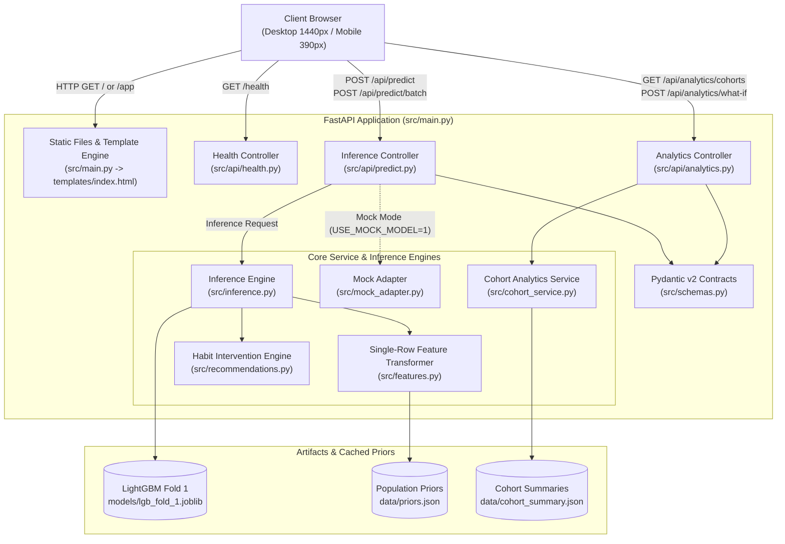

# Smartphone Addiction Prediction Analytical Platform Architecture
Technical architecture for the Smartphone Addiction Prediction analytical platform, defining the FastAPI service layout, LightGBM inference engine, population priors cache, hybrid cohort analytics, and bespoke editorial frontend.

Status: FROZEN

---

## Overview
The Smartphone Addiction Prediction Analytical Platform is a high-performance diagnostic and cohort analytics system that evaluates behavioral smartphone dependency risk and benchmarks individual digital habits against a 691,369-participant population dataset. The system exposes an asynchronous FastAPI REST API backed by a single-fold LightGBM gradient boosted tree model (`models/lgb_fold_1.joblib`) operating on 74 engineered features derived via pre-computed population priors. A bespoke, responsive single-page web interface (HTML5, CSS3, ES6 JavaScript, Chart.js) interacts with the backend over HTTP/JSON to deliver instant slider-driven risk evaluations (<20ms latency), dynamic threshold calibrations, demographic cohort distributions, and habit intervention recommendations. For architectural trade-offs and rationale, see [decisions](DECISIONS.md); for user journeys and acceptance criteria, see [specification](SPEC.md); for prototype review feedback, see [feedback](FEEDBACK.md).

---

## Technology stack
- **Programming Language**: Python 3.13.2
- **Backend Web Framework**: FastAPI 0.115.6 with Uvicorn 0.32.1 (ASGI server)
- **Validation & Serialization**: Pydantic v2.10 (built into FastAPI 0.115)
- **Machine Learning & Inference**: LightGBM 4.7.0, Scikit-learn 1.8.0, Joblib 1.4.2, NumPy 2.2.3, Pandas 2.2.3
- **Frontend Architecture**: Bespoke Vanilla HTML5 / CSS3 / ES6 JavaScript (zero Node build pipeline for runtime serving)
- **Data Visualization**: Chart.js 4.4.1 and custom SVG gauge meters
- **Typography & Styling**: Editorial design tokens utilizing IBM Plex Sans and Source Serif 4 font families
- **Test Framework**: Pytest 8.3.4 with `pytest-asyncio` 0.24.0 and `httpx` 0.28.1 (for `TestClient`)

---

## Test commands
Three exact test commands govern automated verification across development cycles.

- **Full test suite**:
  ```bash
  pytest -q
  ```
  Runs all unit, regression, feature transformation, cohort analytics, and API integration tests.

- **Fast test suite**:
  ```bash
  pytest -q -m "not slow"
  ```
  Runs all rapid unit, schema validation, mock adapter, and API tests while skipping tests marked `@pytest.mark.slow` (such as raw dataset parsing, large model disk loads, and multi-thousand row batch scoring benchmarks). Executed automatically after every development task and guaranteed to complete in under 5 seconds.

- **Single test file execution**:
  ```bash
  pytest -q tests/test_<module>.py
  ```
  Targeted execution pattern for single test modules (e.g., `pytest -q tests/test_api.py` or `pytest -q tests/test_inference.py`).

*Note on baseline*: The untouched repository contained zero automated tests (pytest collected 0 items with exit code 1). The first engineering milestone introduces `pytest.ini` with the `slow` marker definition and establishes comprehensive test coverage in `tests/`.

---

## Components



### Component Descriptions
- **Client Browser**: Responsive single-page analytical UI delivering real-time slider controls, live SVG gauge rendering with positive text clearance, single authoritative status pill, dynamic threshold adjustment, cohort distributions, and What-If scenarios.
- **FastAPI Application (`src/main.py`)**: Root application orchestrator configuring CORS, middleware, static directory mounting, exception handlers, and routing.
- **Health Controller (`src/api/health.py`)**: Validates model availability, prior file integrity, and process telemetry.
- **Inference Controller (`src/api/predict.py`)**: Handles single-profile and batch CSV prediction requests, enforcing Pydantic validation and telemetry tracking.
- **Analytics Controller (`src/api/analytics.py`)**: Exposes demographic cohort aggregations, distribution percentiles, and counterfactual What-If simulation deltas.
- **Pydantic v2 Contracts (`src/schemas.py`)**: Defines strictly typed request and response payloads with physiological bounds validation.
- **Inference Engine (`src/inference.py`)**: Loads `models/lgb_fold_1.joblib` and evaluates single-sample or batch arrays within $<20\text{ms}$.
- **Mock Adapter (`src/mock_adapter.py`)**: High-speed stand-in implementing the inference interface with calibrated centered baseline heuristics (~50% at median habits) for instant UI prototyping and isolated tests.
- **Single-Row Feature Transformer (`src/features.py`)**: Builds the exact 74 feature columns required by LightGBM using cached population priors to avoid single-row `NaN` or zero-variance failure.
- **Cohort Analytics Service (`src/cohort_service.py`)**: Queries pre-aggregated cohort distributions and quantiles from in-memory cache for sub-2ms response times.
- **Habit Intervention Engine (`src/recommendations.py`)**: Evaluates behavioral ratios against clinical digital hygiene thresholds to return actionable lifestyle interventions.
- **Data & Model Artifacts (`models/`, `data/`)**: Persisted model weights (`lgb_fold_1.joblib`), population priors (`priors.json`), and pre-calculated cohort tables (`cohort_summary.json`).

---

## Data models

All models are implemented using **Pydantic v2** (`BaseModel`) with strict type validation, field constraints, and descriptive docstrings.

### 1. `BehavioralProfileInput`
Core input schema capturing demographic characteristics, time budget allocations, and interaction volumes.

| Field | Type | Validation Rules / Bounds | Default | Description |
| :--- | :--- | :--- | :--- | :--- |
| `age` | `int` | $18 \le \text{age} \le 35$ | `25` | Participant age in years |
| `gender` | `str` | `Literal["Female", "Male", "Other"]` | `"Male"` | Participant gender |
| `stress_level` | `str` | `Literal["Low", "Medium", "High"]` | `"Medium"` | Self-reported chronic stress level |
| `academic_work_impact` | `str` | `Literal["No", "Yes"]` | `"Yes"` | Observed negative impact on work/studies |
| `daily_screen_time_hours` | `float` | $0.5 \le t \le 16.0$ | `7.5` | Average weekday daily screen time in hours |
| `social_media_hours` | `float` | $0.0 \le t \le 12.0$ | `3.5` | Daily social media consumption in hours |
| `gaming_hours` | `float` | $0.0 \le t \le 10.0$ | `1.2` | Daily gaming screen time in hours |
| `work_study_hours` | `float` | $0.0 \le t \le 14.0$ | `2.5` | Daily productive work/study usage in hours |
| `weekend_screen_time` | `float` | $0.5 \le t \le 18.0$ | `9.5` | Average weekend daily screen time in hours |
| `sleep_hours` | `float` | $3.0 \le t \le 12.0$ | `6.8` | Average night sleep duration in hours |
| `notifications_per_day` | `int` | $10 \le n \le 300$ | `140` | Estimated notifications received daily |
| `app_opens_per_day` | `int` | $10 \le n \le 250$ | `100` | Estimated unlock and app launch events daily |
| `decision_threshold` | `float` | $0.10 \le \tau \le 0.90$ | `0.50` | Classification decision threshold $\tau$ |

*Physiological Validation Constraint*: A root validator verifies whether `daily_screen_time_hours + sleep_hours > 24.0`. If exceeded, a non-fatal warning flag `exceeds_daily_budget: bool = True` is included in the response metrics, while the API continues operational inference.

### 2. `BehavioralMetrics`
Derived behavioral ratios and habit fragmentation indicators.

| Field | Type | Description |
| :--- | :--- | :--- |
| `screen_to_sleep_ratio` | `float` | Ratio of daily screen time to sleep duration (`screen / sleep`) |
| `recreational_share` | `float` | Proportion of screen time spent on social media and gaming |
| `avg_unlock_minutes` | `float` | Estimated continuous minutes between unlock events |
| `weekend_surge_hours` | `float` | Difference between weekend and weekday daily screen time |
| `total_accounted_hours`| `float` | Sum of screen, work/study, and sleep hours |
| `exceeds_daily_budget` | `bool` | True if screen hours + sleep hours exceeds 24.0h |

### 3. `PredictionResponse`
Diagnostic assessment returned by the live scoring engine. Integrates consolidated status label and authoritative presentation attributes.

| Field | Type | Description |
| :--- | :--- | :--- |
| `addiction_probability` | `float` | Model probability $\in [0.0, 1.0]$ |
| `is_addicted` | `bool` | `true` if `addiction_probability >= decision_threshold` |
| `risk_tier` | `str` | `"LOW"` ($p < 0.40$), `"MODERATE"` ($0.40 \le p < 0.70$), or `"HIGH"` ($p \ge 0.70$) |
| `status_label` | `str` | Consolidated authoritative status string (e.g., `"ADDICTION DETECTED • HIGH RISK"` or `"HEALTHY PATTERN • LOW RISK"`) |
| `decision_threshold` | `float` | Evaluated classification threshold $\tau$ |
| `metrics` | `BehavioralMetrics` | Granular derived behavioral metrics |
| `recommendations` | `list[str]` | Prioritized rule-based digital hygiene action items |
| `latency_ms` | `float` | Total inference compute duration in milliseconds |

### 4. `CohortFilterParams`
Query parameters for demographic and psychological cohort slicing.

| Field | Type | Validation Rules | Default | Description |
| :--- | :--- | :--- | :--- | :--- |
| `age_group` | `str` | `Literal["all", "18-20", "21-25", "26-30", "31-35"]` | `"all"` | Age cohort filter |
| `gender` | `str` | `Literal["all", "Female", "Male", "Other"]` | `"all"` | Gender filter |
| `stress_level` | `str` | `Literal["all", "Low", "Medium", "High"]` | `"all"` | Stress level filter |
| `academic_work_impact` | `str` | `Literal["all", "No", "Yes"]` | `"all"` | Work/academic impact filter |

### 5. `CohortDistributionResponse`
Analytical breakdown of cohort statistics for population charts and benchmarking.

| Field | Type | Description |
| :--- | :--- | :--- |
| `cohort_name` | `str` | Descriptive label of the filtered cohort |
| `sample_size` | `int` | Number of participants represented |
| `addiction_prevalence`| `float` | Percentage of cohort classified as addicted ($[0.0, 100.0]$) |
| `screen_time_percentiles`| `dict[str, float]` | 10th, 25th, 50th, 75th, 90th percentiles for screen time |
| `sleep_percentiles` | `dict[str, float]` | 10th, 25th, 50th, 75th, 90th percentiles for sleep hours |
| `screen_time_bins` | `list[dict[str, Any]]` | Histogram bin distribution (`bin_start`, `bin_end`, `count`) |
| `sleep_bins` | `list[dict[str, Any]]` | Histogram bin distribution for sleep |

### 6. `WhatIfRequest` & `WhatIfResponse`
Counterfactual scenario simulation contract.

- **`WhatIfRequest`**: Contains `baseline: BehavioralProfileInput` and `modifications: dict[str, float]` (e.g. `{"social_media_hours": -1.5, "sleep_hours": 1.0}`).
- **`WhatIfResponse`**: Contains `baseline_probability: float`, `simulated_probability: float`, `risk_delta: float`, `baseline_risk_tier: str`, `simulated_risk_tier: str`, `status_label: str`, and `key_drivers: list[str]`.

### 7. `HealthResponse`
System diagnostics and model telemetry.

| Field | Type | Description |
| :--- | :--- | :--- |
| `status` | `str` | `"healthy"` or `"degraded"` |
| `model_loaded` | `bool` | True if LightGBM Fold 1 is initialized |
| `priors_loaded` | `bool` | True if population priors are cached in memory |
| `cohort_cache_loaded`| `bool` | True if cohort summary analytical cache is loaded |
| `mock_mode` | `bool` | True if running under mock adapter |
| `uptime_seconds` | `float` | Server process uptime |

---

## Interfaces

### 1. HTTP REST Endpoints

#### `GET /health`
Returns system operational status, model availability, and cache state.
- **Input**: None
- **Output**: `200 OK` with `HealthResponse`
- **Errors**: `503 Service Unavailable` if critical artifacts cannot be found.

#### `POST /api/predict`
Executes real-time single-row risk evaluation and behavioral ratio calculation.
- **Input**: JSON body conforming to `BehavioralProfileInput`
- **Output**: `200 OK` with `PredictionResponse` (including consolidated `status_label`)
- **Errors**: `422 Unprocessable Entity` for invalid types or boundary violations.

#### `GET /api/analytics/cohorts`
Retrieves pre-aggregated cohort distributions and percentile curves.
- **Input**: Query parameters matching `CohortFilterParams`
- **Output**: `200 OK` with `CohortDistributionResponse`
- **Errors**: `400 Bad Request` for unknown filter combinations.

#### `POST /api/analytics/what-if`
Calculates counterfactual risk reduction scenarios against an adjusted profile.
- **Input**: JSON body conforming to `WhatIfRequest`
- **Output**: `200 OK` with `WhatIfResponse`
- **Errors**: `422 Unprocessable Entity` for illegal attribute adjustments.

#### `POST /api/predict/batch`
Performs batch scoring on uploaded CSV datasets matching competition schema.
- **Input**: `multipart/form-data` containing `file: UploadFile` (.csv)
- **Output**: Downloadable annotated CSV file with added columns `addiction_probability`, `risk_tier`, and `status_label`.
- **Errors**: `400 Bad Request` if CSV headers do not match expected raw columns.

#### `GET /` and `GET /app`
Renders the single-page editorial dashboard HTML template.
- **Input**: None
- **Output**: `200 OK` (text/html)

---

### 2. Core Python Function Signatures

#### Inference Engine (`src/inference.py`)
```python
class InferenceEngine:
    def __init__(self, model_path: str, priors_path: str) -> None:
        """Loads LightGBM Fold 1 booster and cached population priors."""
        ...
        
    def predict(self, profile: BehavioralProfileInput) -> PredictionResponse:
        """Transforms single profile into 74-feature array and computes risk probability."""
        ...

    def batch_predict(self, df_raw: pd.DataFrame) -> pd.DataFrame:
        """Transforms multi-row DataFrame and generates predictions for all records."""
        ...
```

#### Population Priors Loader (`src/priors.py`)
```python
def load_population_priors(priors_path: str) -> dict[str, Any]:
    """Loads precomputed population statistics dictionary or fails fast."""
    ...

def build_single_row_features(
    profile: BehavioralProfileInput, 
    priors: dict[str, Any]
) -> np.ndarray:
    """Vectorized derivation of exact 74 features from single profile using priors."""
    ...
```

#### Cohort Analytics Service (`src/cohort_service.py`)
```python
class CohortService:
    def __init__(self, cache_path: str) -> None:
        """Loads precomputed demographic cohort distributions into memory."""
        ...

    def get_cohort_distribution(
        self, 
        params: CohortFilterParams
    ) -> CohortDistributionResponse:
        """Returns distribution histograms and quantiles for matching demographic cohort."""
        ...
```

#### Rule-Based Recommendations (`src/recommendations.py`)
```python
def generate_recommendations(
    profile: BehavioralProfileInput, 
    metrics: BehavioralMetrics, 
    probability: float
) -> list[str]:
    """Evaluates behavioral ratios and probability to generate prioritized habit advice."""
    ...
```

---

### 3. Mock Adapter Module (`src/mock_adapter.py`)
To allow instant UI development, rapid layout iteration, and fast headless browser testing without loading the 50MB LightGBM model into memory, the system provides a mock adapter implementing the identical interface.

In response to Round 1 user feedback (calibrating baseline probability from extreme 99% to ~50% for median habits), the mock scoring engine uses a centered logit equation centered on population medians:

```python
class MockInferenceEngine:
    """Mock inference adapter implementing identical interface with calibrated baseline."""
    
    def predict(self, profile: BehavioralProfileInput) -> PredictionResponse:
        stress_map = {"Low": 0, "Medium": 1, "High": 2}
        impact_map = {"No": 0, "Yes": 1}
        
        # Centered logit model: yields ~50.5% (48-52%) on standard population baseline
        logit = (
            0.02
            + 0.35 * (profile.daily_screen_time_hours - 7.5)
            + 0.40 * (profile.social_media_hours - 3.5)
            + 0.25 * (profile.gaming_hours - 1.2)
            + 0.18 * (profile.weekend_screen_time - 9.5)
            - 0.35 * (profile.sleep_hours - 6.8)
            + 0.008 * (profile.notifications_per_day - 140)
            + 0.010 * (profile.app_opens_per_day - 100)
            + 0.22 * (stress_map.get(profile.stress_level, 1) - 1)
            + 0.30 * (impact_map.get(profile.academic_work_impact, 1) - 1)
        )
        prob = float(np.clip(1.0 / (1.0 + np.exp(-logit)), 0.02, 0.98))
        is_addicted = prob >= profile.decision_threshold
        tier = "HIGH" if prob >= 0.70 else ("MODERATE" if prob >= 0.40 else "LOW")
        
        # Unified authoritative status label consolidating decision and tier
        status_label = (
            f"ADDICTION DETECTED • {tier} RISK" if is_addicted 
            else f"HEALTHY PATTERN • {tier} RISK"
        )
        
        metrics = compute_metrics(profile)
        recs = generate_recommendations(profile, metrics, prob)
        return PredictionResponse(
            addiction_probability=round(prob, 4),
            is_addicted=is_addicted,
            risk_tier=tier,
            status_label=status_label,
            decision_threshold=profile.decision_threshold,
            metrics=metrics,
            recommendations=recs,
            latency_ms=0.45
        )
```

The application seamlessly swaps between the real LightGBM engine and the mock adapter using the environment variable `USE_MOCK_MODEL=true`.

---

### 4. UI Component & Visual Layout Contracts

Following Round 1 prototype review feedback, two visual contracts are explicitly defined to prevent layout collisions and redundant indicator badges:

#### SVG Risk Gauge Geometry & Text Clearance Contract
- **Arc Geometry**: The SVG circular arc gauge is drawn in a viewBox of `0 0 240 170` with arc center $(120, 120)$, radius $R=85$, stroke-width $14\text{px}$, and angular sweep of $220^\circ$ (from $160^\circ$ to $380^\circ$).
- **Terminal Feet Bounds**: The arc ends at vertical coordinate $Y \approx 149.1\text{px}$, leaving $20.9\text{px}$ of internal SVG padding above the bottom of the viewBox ($170\text{px}$).
- **Gauge Center Value**: The numerical percentage text (e.g. `50.5%`) is positioned at SVG coordinates $(120, 112)$.
- **Sub-Gauge Label Layout**: The caption label `ADDICTION RISK PROBABILITY` is placed in an external layout container (`div.gauge-caption`) below the SVG canvas with an explicit positive top margin (`margin-top: 1rem; margin-bottom: 0;`). Negative margins are strictly prohibited, ensuring at least $32\text{px}$ visual vertical clearance between the bottom feet of the arc and the caption text.

#### Consolidated Authoritative Status Pill Contract
- **Single Authoritative Indicator**: To eliminate visual redundancy, the UI consolidates the two legacy indicators (`HIGH ADDICTION PROBABILITY` and `ADDICTION DETECTED`) into a single authoritative status pill (`div.status-pill`).
- **Pill Content & Styling**: Displays `PredictionResponse.status_label` (e.g., `ADDICTION DETECTED • HIGH RISK` or `HEALTHY PATTERN • LOW RISK`). Styled with semantic theme tokens (`--color-status-danger` for detected, `--color-status-warning` for borderline/moderate, `--color-status-success` for healthy pattern), establishing unambiguous diagnostic clarity.

---

### 5. UI Preview and Screenshot Commands

- **Preview command**:
  ```bash
  uvicorn src.main:app --host 127.0.0.1 --port 8000 --reload
  ```
  Local preview URL: `http://127.0.0.1:8000/app` (or `http://127.0.0.1:8000/`)

- **Screenshot verification commands** (Playwright CLI):
  - **Desktop (1440px)**:
    ```bash
    npx playwright screenshot --url http://127.0.0.1:8000/app --viewport-size 1440,900 .ui-review/m1-dashboard-desktop.png
    ```
  - **Mobile (390px)**:
    ```bash
    npx playwright screenshot --url http://127.0.0.1:8000/app --viewport-size 390,844 .ui-review/m1-dashboard-mobile.png
    ```

---

## Directory layout

```
SmartphoneAddictionPrediction/
├── app/                                  # Deprecated prototype layer
│   └── app.py                            # Legacy Streamlit script (kept for baseline reference)
├── data/                                 # Datasets & generated analytical caches
│   ├── train.csv                         # 691,369 labeled records (competition training set)
│   ├── test.csv                          # 296,302 unlabeled records (competition test set)
│   ├── priors.json                       # Precomputed population priors for single-row inference
│   └── cohort_summary.json               # Pre-aggregated demographic distributions & quantiles
├── docs/                                 # Living documentation suite
│   ├── ARCHITECTURE.md                   # This document
│   ├── DECISIONS.md                      # Architecture Decision Records (ADRs)
│   ├── SPEC.md                           # Functional specification & user journeys
│   ├── PROJECT_MENTAL_MODEL.md           # Vision, routing flags, and roadmap
│   ├── CODEBASE_MAP.md                   # Existing codebase architecture and inventory
│   ├── FEEDBACK.md                       # Feedback log from user reviews
│   └── PROJECT_STATUS.md                 # Workflow status checklist
├── models/                               # Trained gradient boosting and neural checkpoints
│   ├── lgb_fold_1.joblib                 # Champion LightGBM Fold 1 checkpoint (~49.5MB)
│   ├── lgb_fold_2.joblib .. fold_5.joblib# Remaining LightGBM folds
│   ├── xgb_fold_1.joblib .. fold_5.joblib# 5-fold XGBoost checkpoints
│   ├── cat_fold_1.joblib .. fold_5.joblib# 5-fold CatBoost checkpoints
│   ├── nn_fold_1.pt .. fold_5.pt         # 5-fold PyTorch Tabular ResNet checkpoints
│   └── oof_predictions.npz               # Out-of-fold validation prediction matrices
├── scripts/                              # Offline preparation & cache generation scripts
│   ├── generate_priors.py                # Extracts population priors from data/train.csv
│   └── generate_cohort_cache.py          # Pre-aggregates cohort distributions into JSON
├── src/                                  # Production FastAPI application & service layer
│   ├── __init__.py
│   ├── main.py                           # Application initialization, middleware, routing
│   ├── config.py                         # Pydantic BaseSettings environment configuration
│   ├── schemas.py                        # Pydantic v2 data models & validation rules
│   ├── features.py                       # Single-row & batch 74-feature extraction logic
│   ├── priors.py                         # Priors loader and vectorized single-row transformer
│   ├── inference.py                      # LightGBM Fold 1 model loader & inference engine
│   ├── mock_adapter.py                   # Calibrated mock inference adapter for UI dev/tests
│   ├── cohort_service.py                 # Hybrid cohort analytics query service
│   ├── recommendations.py                # Rule-based habit intervention generator
│   ├── api/                              # Modular API route controllers
│   │   ├── __init__.py
│   │   ├── health.py                     # GET /health
│   │   ├── predict.py                    # POST /api/predict & POST /api/predict/batch
│   │   └── analytics.py                  # GET /api/analytics/cohorts & what-if endpoints
│   ├── static/                           # Bespoke frontend client assets
│   │   ├── css/
│   │   │   ├── tokens.css                # Color, typography, and elevation design tokens
│   │   │   └── style.css                 # Editorial styling, grid layout, responsive breakpoints
│   │   ├── js/
│   │   │   ├── app.js                    # SPA state management, slider debouncing, API client
│   │   │   └── charts.js                 # Chart.js renderers, SVG risk gauge, distribution plots
│   │   └── favicon.ico
│   └── templates/                        # Server-rendered HTML templates
│       └── index.html                    # Single-page dashboard markup
├── tests/                                # Automated test suite
│   ├── conftest.py                       # Shared test fixtures, mock engine, and TestClient
│   ├── test_features.py                  # Single-row feature derivation & prior matching tests
│   ├── test_inference.py                 # LightGBM inference validation & latency benchmarks
│   ├── test_cohort_service.py            # Cohort distribution cache & percentile query tests
│   ├── test_recommendations.py           # Digital hygiene recommendation rules tests
│   └── test_api.py                       # FastAPI endpoint HTTP integration tests
├── .env.example                          # Environment configuration template
├── pytest.ini                            # Pytest configuration and custom marker registrations
├── README.md                             # Repository overview and competitive benchmarks
└── requirements.txt                      # Python dependencies manifest
```

---

## Configuration

Application configuration is managed via `pydantic-settings` in `src/config.py` and reads environment variables with local defaults. The variables are documented in `.env.example`:

| Variable | Type | Default | Description |
| :--- | :--- | :--- | :--- |
| `APP_HOST` | `str` | `127.0.0.1` | Local network binding address |
| `APP_PORT` | `int` | `8000` | Port for the Uvicorn ASGI server |
| `APP_DEBUG` | `bool` | `False` | Enables verbose debug logging |
| `MODEL_PATH` | `str` | `models/lgb_fold_1.joblib` | Path to the serialized LightGBM Fold 1 model |
| `PRIORS_PATH` | `str` | `data/priors.json` | Path to the pre-computed population priors JSON |
| `COHORT_CACHE_PATH` | `str` | `data/cohort_summary.json` | Path to pre-aggregated cohort distributions JSON |
| `USE_MOCK_MODEL` | `bool` | `False` | When True, bypasses model loading with mock adapter |
| `CORS_ORIGINS` | `str` | `["*"]` | Allowed CORS origins for frontend access |

---

## Setup requirements

### Tools
| Name | Minimum Version | Command |
| :--- | :--- | :--- |
| Python | 3.11 | `python --version` |
| Node.js / npx | 18.0 | `node --version` |
| Impeccable | Latest | launcher check |
| Playwright (with Chromium) | 1.40 | `npx playwright --version` |

### Accounts and credentials
None

### Local services
None

---

## Expensive to change

The following architectural decisions, data models, and interface boundaries are expensive or high-risk to modify after freezing:

1. **Tabular Feature Engineering Schema (74 Features)**
   - *Why*: The serialized LightGBM model checkpoint (`models/lgb_fold_1.joblib`) was compiled with a strict 74-column feature schema in exact column order. Any change to feature names, transformations, or order invalidates the model binary and requires re-running training pipelines and regenerating population priors.
2. **Population Priors & Cohort Analytical Caches (`data/priors.json`, `data/cohort_summary.json`)**
   - *Why*: Single-row live inference (<20ms latency) and sub-2ms cohort analytics depend on precomputed summary distributions extracted from the 691,369-row training set. Altering the schema of these JSON files breaks both the Python feature transformer and frontend chart decoders.
3. **Core REST API Contract (`/api/predict`, `/api/analytics/cohorts`, `/api/analytics/what-if`)**
   - *Why*: The bespoke frontend single-page interface communicates with the backend via asynchronous JSON payloads. Modifying field names, nesting structures, or validation constraints breaks client slider debouncing, the unified status pill, gauge calculations, and counterfactual simulations.
4. **Authentication & Sessionless Architecture**
   - *Why*: The system is designed as a stateless, local-first analytical platform with zero authentication or user state persistence. Introducing an authentication layer (OAuth, JWT, database user tables) would require introducing persistent database dependencies, session middleware, and modifying every HTTP route signature.
5. **Hosting & Deployment Model (Self-Contained FastAPI + Static Asset Pipeline)**
   - *Why*: Serving vanilla HTML5/CSS3/ES6 directly from FastAPI avoids Node.js / npm build pipelines during runtime. Introducing a separate frontend server (e.g. Next.js or Vite server) would fundamentally change the development workflow, deployment scripts, and test runner configurations.
6. **Interface Compatibility with Existing ML Code (`src/features.py`, `src/train.py`, `src/ensemble.py`)**
   - *Why*: Existing training, cross-validation, and ensembling scripts in `src/` must remain compatible with Kaggle dataset schemas and baseline benchmarking workflows.
